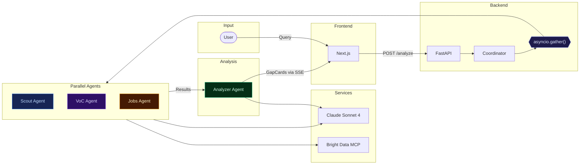
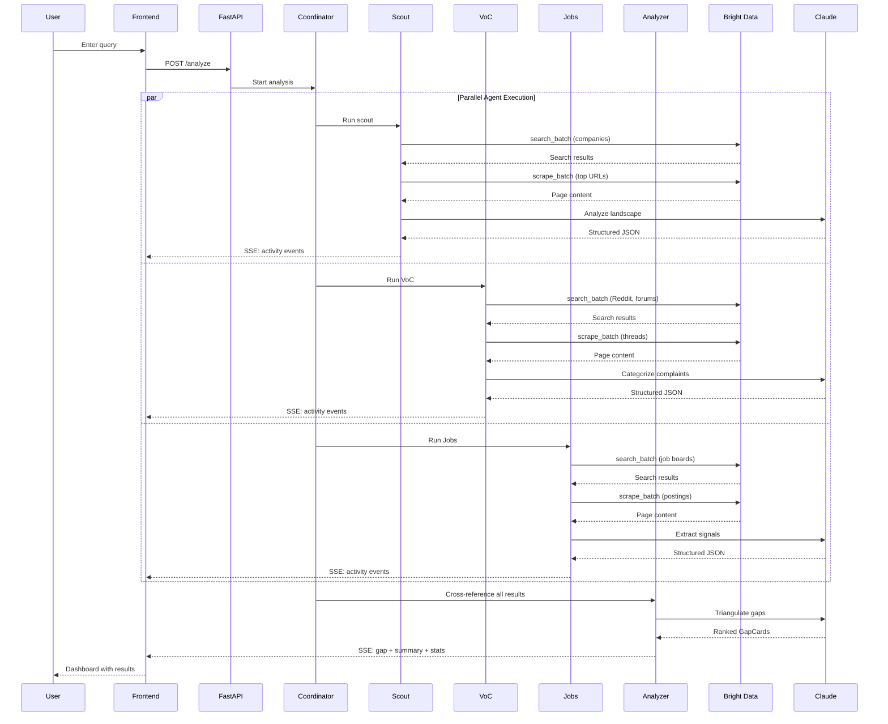
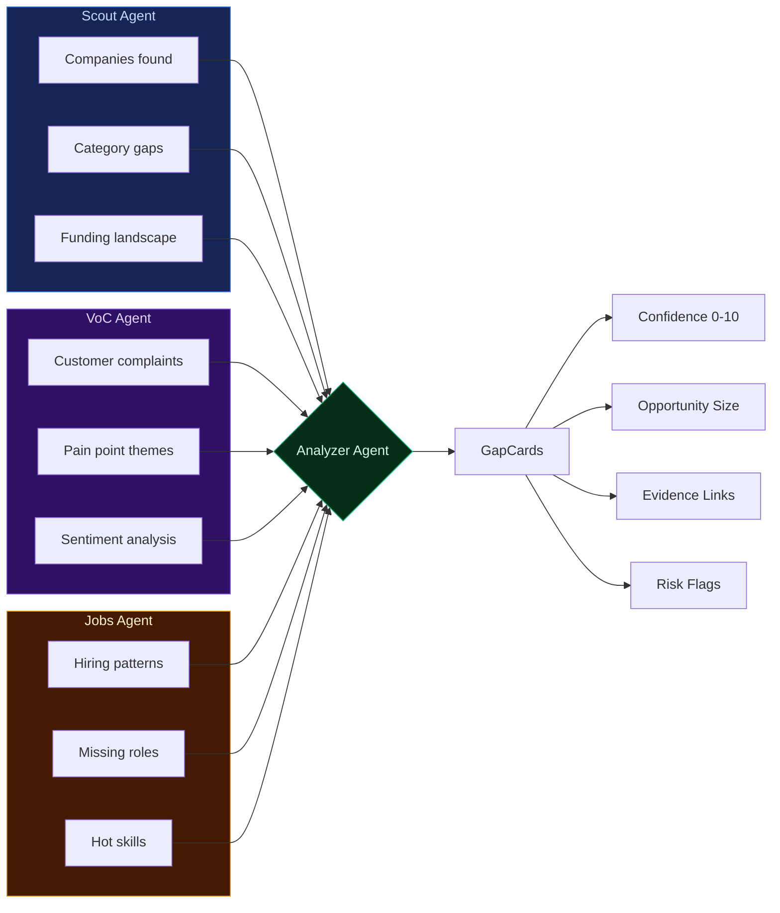
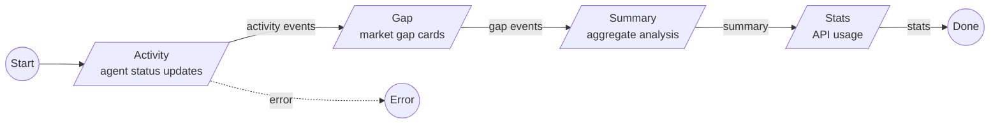
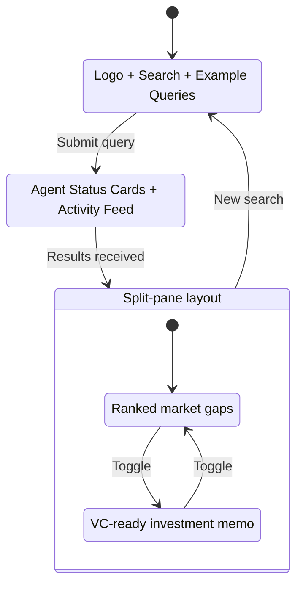
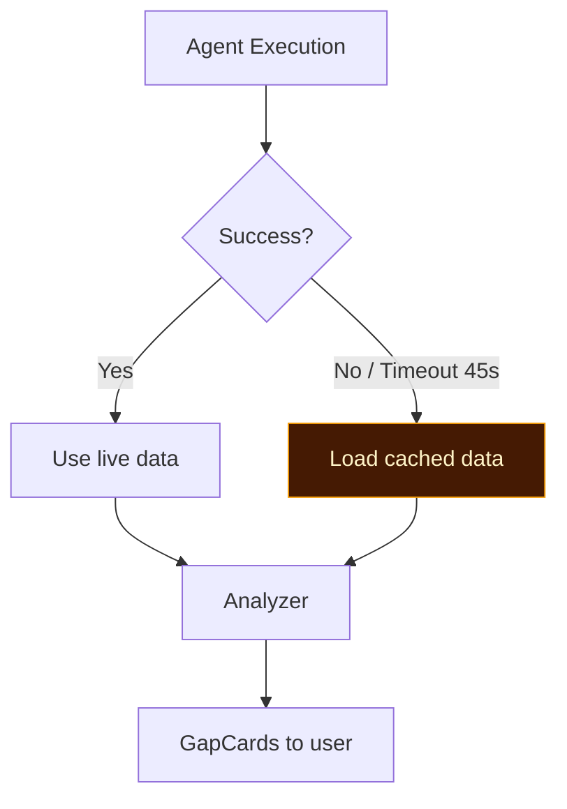

# Blindspot

**Multi-agent AI system that identifies untapped market opportunities** by orchestrating three specialized agents in parallel — scraping, cross-referencing, and scoring live web signals to deliver ranked, evidence-backed market gap analysis in under 60 seconds.

Built for VCs, product teams, and strategy consultants who need rapid market intelligence without weeks of manual research.

## Tech Stack

| Layer | Technology |
|-------|-----------|
| Frontend | Next.js 14, React 18, TypeScript, Tailwind CSS |
| UI Components | shadcn/ui + Magic UI |
| Animations | Motion (Framer Motion) |
| Backend | FastAPI, Python 3.11+, Uvicorn |
| Real-time | Server-Sent Events (SSE) |
| LLM | Claude Sonnet 4 (Anthropic API) |
| Web Intelligence | Bright Data MCP |
| Orchestration | Pure `asyncio.gather()` — no framework overhead |

## Architecture



## Agent Pipeline



## Data Flow & Triangulation



**Confidence scoring:**
- **8–10**: All 3 agents agree
- **5–8**: 2 agents agree
- **3–5**: Single source only
- **−2 penalty** if sources contradict

## Project Structure

```
blindspot/
├── backend/
│   ├── main.py                 # FastAPI app, CORS, SSE /analyze endpoint
│   ├── coordinator.py          # Agent orchestration, query parsing, fallbacks
│   ├── config.py               # Environment variables & timeouts
│   ├── mcp_client.py           # Bright Data MCP wrapper
│   ├── llm.py                  # Async Anthropic client + JSON extraction
│   ├── models.py               # Pydantic v2 models
│   ├── fallback_data.py        # Pre-cached demo data
│   ├── requirements.txt
│   └── agents/
│       ├── scout.py            # Competitive landscape mapping
│       ├── voc.py              # Voice of Customer (Reddit, forums)
│       ├── jobs.py             # Hiring signal analysis
│       └── analyzer.py         # Cross-reference & gap ranking
│
├── frontend/
│   ├── src/
│   │   ├── app/
│   │   │   ├── page.tsx        # Main UI (landing ↔ dashboard)
│   │   │   ├── layout.tsx      # Root layout, fonts, theme
│   │   │   └── globals.css     # CSS variables, custom scrollbar
│   │   ├── components/
│   │   │   ├── SearchInput.tsx
│   │   │   ├── ActivityFeed.tsx
│   │   │   ├── ActivityItem.tsx
│   │   │   ├── AgentStatusCards.tsx
│   │   │   ├── GapCard.tsx
│   │   │   ├── ConfidenceBadge.tsx
│   │   │   ├── InvestmentMemo.tsx
│   │   │   ├── StatsFooter.tsx
│   │   │   └── ui/            # shadcn + Magic UI components
│   │   ├── hooks/
│   │   │   └── useSSE.ts      # SSE stream handler
│   │   └── types/
│   │       └── index.ts       # TypeScript interfaces
│   ├── package.json
│   ├── tailwind.config.ts
│   └── components.json        # shadcn config
│
├── CLAUDE.md
└── market-gap-finder-prd.md   # Product requirements doc
```

## SSE Event Protocol



| Event | Payload | Purpose |
|-------|---------|---------|
| `activity` | `{ agent, message, status }` | Real-time agent progress |
| `gap` | `{ id, title, confidence, triangulation[], ... }` | Market gap discovery |
| `summary` | `{ market_summary, companies_found, ... }` | Aggregate analysis |
| `stats` | `{ searches, scrapes, agents, duration }` | Bright Data usage |
| `error` | `{ message }` | Error reporting |
| `done` | `{}` | Stream complete |

## Quick Start

### Prerequisites

- Python 3.11+
- Node.js 18+
- [Anthropic API key](https://console.anthropic.com/)
- [Bright Data MCP token](https://brightdata.com/)

### Backend

```bash
cd backend
python -m venv ../venv
source ../venv/bin/activate   # Windows: ..\venv\Scripts\activate
pip install -r requirements.txt
```

Create `backend/.env`:

```env
ANTHROPIC_API_KEY=sk-ant-...
BRIGHTDATA_TOKEN=...
CLAUDE_MODEL=claude-sonnet-4-20250514   # optional
```

```bash
python -m uvicorn main:app --reload --port 8055
```

### Frontend

```bash
cd frontend
npm install
npm run dev
```

Open **http://localhost:3000** and try: *"pet tech in the UK"*

### Verify

```bash
curl http://localhost:8055/health
# → {"status": "ok", "service": "blindspot"}
```

## Frontend States



**Dashboard layout:**

| Left Panel (380px) | Right Panel (flex) |
|---|---|
| Agent status cards | GapCards or Investment Memo |
| Live activity feed | Market summary + stats |
| | Evidence triangulation bars |

## Agents In Detail

| Agent | Searches For | Sources | Output |
|-------|-------------|---------|--------|
| **Scout** | Companies, funding, categories | Company websites, Crunchbase | Competitor map, category gaps |
| **VoC** | Complaints, pain points, wishes | Reddit, Trustpilot, forums | Themed pain points, sentiment |
| **Jobs** | Hiring patterns, skill gaps | LinkedIn, Indeed | Hot skills, missing roles |
| **Analyzer** | Cross-signal patterns | All 3 agents above | Ranked GapCards with confidence |

## Fault Tolerance



- Each agent wrapped in a 45s timeout
- `asyncio.gather(return_exceptions=True)` — one failure doesn't crash others
- Pre-cached fallback data for demo scenarios (pet tech, fintech, dev tools)
- Fallback is invisible to users — same GapCard format

## Key Design Decisions

| Decision | Rationale |
|----------|-----------|
| `asyncio.gather()` over LangGraph | Zero framework overhead, faster, simpler |
| SSE over WebSocket | One-directional stream, works through proxies |
| MCP over REST scraping | Standardized tool protocol, session management |
| Claude Sonnet 4 | Best reasoning-to-speed ratio for real-time analysis |
| No database | Stateless per-request — no persistence needed |
| Dark-only theme | Focused design, polished aesthetic |

## License

This project is proprietary. All rights reserved.
