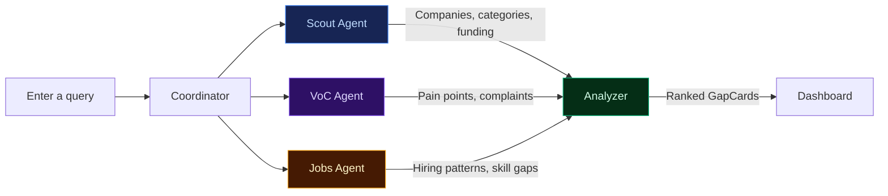
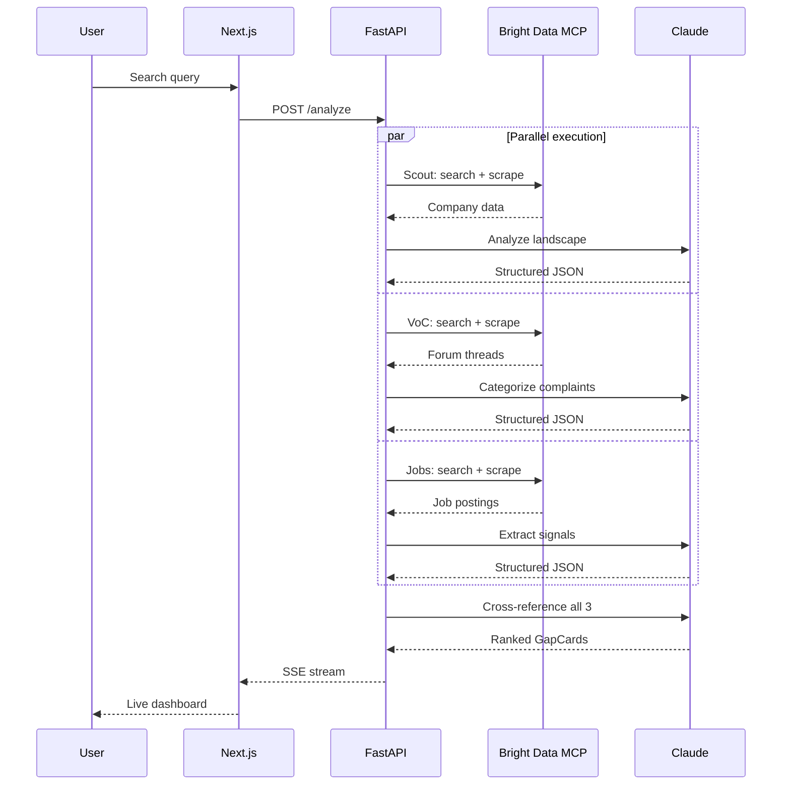
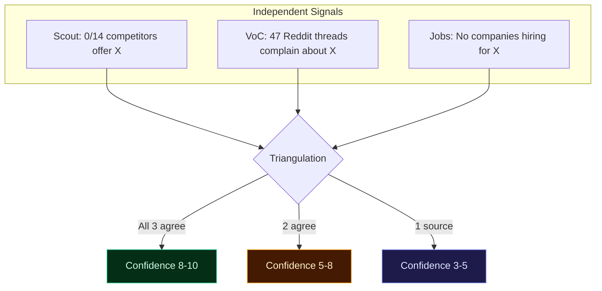
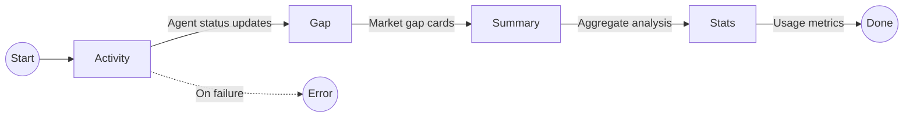
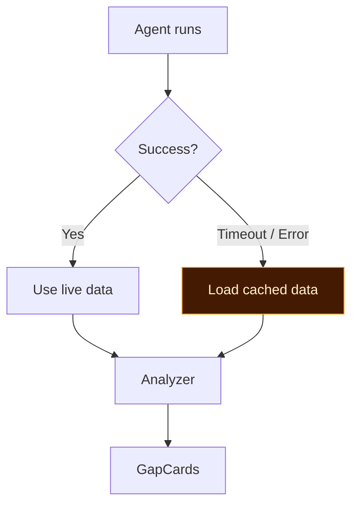

# Blindspot

Multi-agent AI system that identifies untapped market opportunities by orchestrating specialized agents in parallel — scraping, cross-referencing, and scoring live web signals to deliver ranked, evidence-backed market gap analysis in under 60 seconds.

## How It Works



Three agents run in parallel, each researching a different signal:

- **Scout** — maps the competitive landscape (companies, categories, funding)
- **VoC** — mines customer pain points from Reddit, Trustpilot, and forums
- **Jobs** — analyzes hiring patterns to detect what's being built and what isn't

An **Analyzer** cross-references all three to find gaps where demand exists but supply doesn't.

## Architecture



## Evidence Triangulation



Gaps confirmed by multiple independent sources score higher. Contradictory signals apply a -2 penalty.

## SSE Event Flow



| Event | Payload | Purpose |
|-------|---------|---------|
| `activity` | `{ agent, message }` | Real-time agent progress |
| `gap` | `{ id, title, confidence, triangulation[] }` | Market gap discovery |
| `summary` | `{ market_summary, companies_found }` | Aggregate analysis |
| `stats` | `{ searches, scrapes, duration }` | API usage metrics |
| `done` | `{}` | Stream complete |

## Fault Tolerance



- Each agent has a 45s timeout
- `asyncio.gather(return_exceptions=True)` — one failure doesn't crash others
- Cached fallback data substitutes seamlessly

## Tech Stack

| Layer | Technology |
|-------|-----------|
| Frontend | Next.js 14, React 18, TypeScript, Tailwind CSS |
| Backend | FastAPI, Python 3.11+ |
| Real-time | Server-Sent Events (SSE) |
| LLM | Claude Sonnet 4 (Anthropic API) |
| Web Intelligence | Bright Data MCP Server |
| Orchestration | `asyncio.gather()` |

## Quick Start

### Prerequisites

- Python 3.11+
- Node.js 18+
- [Anthropic API key](https://console.anthropic.com/)
- [Bright Data MCP token](https://brightdata.com/)

### Backend

```bash
cd backend
python -m venv ../venv
source ../venv/bin/activate   # Windows: ..\venv\Scripts\activate
pip install -r requirements.txt
```

Create `backend/.env`:

```env
ANTHROPIC_API_KEY=sk-ant-...
BRIGHTDATA_TOKEN=...
```

```bash
python -m uvicorn main:app --reload --port 8055
```

### Frontend

```bash
cd frontend
npm install
npm run dev
```

Open **http://localhost:3000** and try: *"Find market gaps in pet tech in the UK"*

## Project Structure

```
blindspot/
├── backend/
│   ├── main.py              # FastAPI app, CORS, SSE endpoint
│   ├── coordinator.py       # Agent orchestration & fallback handling
│   ├── config.py            # Environment variables & timeouts
│   ├── mcp_client.py        # Bright Data MCP wrapper
│   ├── llm.py               # Async Anthropic client + JSON extraction
│   ├── models.py            # Pydantic v2 models
│   ├── fallback_data.py     # Cached fallback data
│   └── agents/
│       ├── scout.py         # Competitive landscape mapping
│       ├── voc.py           # Voice of Customer (Reddit, forums)
│       ├── jobs.py          # Hiring signal analysis
│       └── analyzer.py      # Cross-reference & gap ranking
│
├── frontend/
│   ├── src/
│   │   ├── app/
│   │   │   ├── page.tsx     # Main UI
│   │   │   ├── layout.tsx   # Root layout & theme
│   │   │   └── globals.css  # CSS variables & animations
│   │   ├── components/
│   │   │   ├── SearchInput.tsx
│   │   │   ├── ActivityFeed.tsx
│   │   │   ├── ActivityItem.tsx
│   │   │   ├── AgentStatusCards.tsx
│   │   │   ├── GapCard.tsx
│   │   │   ├── ConfidenceBadge.tsx
│   │   │   ├── InvestmentMemo.tsx
│   │   │   └── StatsFooter.tsx
│   │   ├── hooks/
│   │   │   └── useSSE.ts
│   │   └── types/
│   │       └── index.ts
│   └── package.json
│
└── CLAUDE.md
```

## License

MIT
